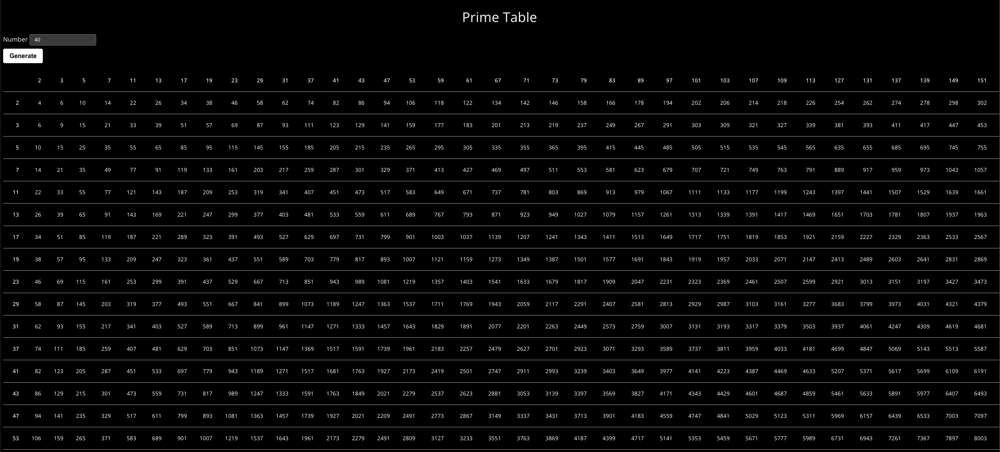

# Prime Table

This web application displays a multiplication table of prime numbers.

It takes in a numeric input n from the user an outputs a multiplication table of n prime numbers.



## How to run it

This app uses Ruby v3.1.2 and runs well in the latest Chrome browser.

To install dependencies, run:

```console
$ bundle
```

The database is PostgreSQL. To create the database, run:

```console
$ bin/rake db:create db:schema:load
```

To run the development server:

```console
$ bin/dev
```

Navigate to http://localhost:3000 to view the app.

To run the Ruby tests:

```console
$ bin/rspec
```

To run the JS tests:

```console
$ yarn test
```

## What I'm pleased with

I think this is a pretty clean, easy to follow application. The logic is divided up in sensible ways
in idomatic places.

## What I would do if I had more time

- Convert each number in the table into a link to a new prime table for that number as n (Issue #3)

## Structure

This app is made using Ruby on Rails. The list of primes is generated server-side through the route
/primes.json and the multiplication table itself is generated on the client using Typescript.

### Prime Generation

The prime numbers are generated in
[app/models/prime_generator.rb](https://github.com/eoogbe/prime_table/blob/main/app/models/prime_generator.rb)
using the Sieve of Eratosthenes, which runs in O(n log(log(n))) time. Since we don't know how high
of a prime the nth prime is, we make successively larger guesses until we get it right. A more
efficient algorithm would be Euler's Sieve, which runs in O(n) time and does not need repeated
guessing. However this algorithm uses modolus, which is not allowed for the exercise.

An ActiveRecord model [`Prime`](https://github.com/eoogbe/prime_table/blob/main/app/models/prime.rb)
saves previously generated primes in the database to remove the need to regenerate them on
successive requests.

### Multiplication Table Generation

The client side generates the multiplication table in batches of 100 on each animation frame. The
implementation is in
[app/javascript/primeTable.ts](https://github.com/eoogbe/prime_table/blob/main/app/javascript/primeTable.ts).
By breaking the generation up into multiple batches, we can generate larger numbers. Unfortunately
there is a limitation on the size of n. The app does not handle displaying a table for n above 1000
very well. The /primes.json route, however, can handle generating primes for much larger numbers.
(It can generate 1,000,000 primes in about 130s.)
